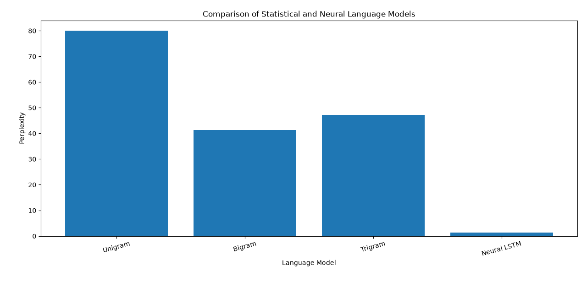

# NLP Pipeline: Statistical vs Neural Language Models

An end-to-end NLP pipeline in Python. It takes a folder of text documents, cleans them, and builds two kinds of language models on the same corpus: n-gram models written from scratch, and an LSTM neural model in Keras. The models are then compared by perplexity.

## What it does

The whole pipeline runs from a single script, `main_.py`, in this order:

1. **Document loading**: reads every `.txt` file in the `dataset/` folder and combines them into one corpus
2. **Preprocessing**: sentence and word tokenization, lowercasing, removal of punctuation and special characters, stop-word removal, and lemmatization
3. **Corpus statistics**: document, sentence, and token counts at each stage, plus vocabulary size
4. **Spelling correction**: Levenshtein edit distance implemented from scratch with dynamic programming; a misspelled word is corrected to its closest match in the corpus vocabulary
5. **Ambiguity handling**: resolves the meaning of the word "bank" (financial institution or river bank) by scoring the context words in the sentence
6. **N-gram language models**: unigram, bigram, and trigram models with Laplace smoothing, trained on 80% of the tokens and tested on the remaining 20%
7. **Sentence probability and perplexity** for each n-gram model
8. **Next-word prediction** with the bigram and trigram models
9. **Neural language model**: an Embedding + LSTM + Dense network trained to predict the next word, with early stopping
10. **Model comparison**: a perplexity table, a bar chart, a training-loss curve, and results saved to CSV

## Dataset

The corpus is three text documents (`.txt` files) in the `dataset/` folder. The documents were generated with an AI tool for this project, so the corpus is small and intended for demonstrating the pipeline rather than for benchmarking.

To use your own data, replace the files in `dataset/` with any `.txt` files; the script picks up every text file in that folder.

## Tech stack

| Purpose | Library |
|---|---|
| Tokenization, stop words, lemmatization | NLTK |
| Neural language model | TensorFlow / Keras |
| Arrays | NumPy |
| Results table | pandas |
| Plots | Matplotlib |

The edit-distance, n-gram counting, smoothing, and perplexity code uses only the Python standard library.

## Project structure

```
.
├── main_.py                 # the full pipeline
├── dataset/                 # input .txt documents
├── model_comparison.csv     # created when the script runs
└── README.md
```

## Getting started

1. Clone the repository

   ```bash
   git clone https://github.com/<your-username>/<repo-name>.git
   cd <repo-name>
   ```

2. Install dependencies

   ```bash
   pip install nltk tensorflow numpy pandas matplotlib
   ```

3. Download the NLTK data (one time only)

   ```python
   import nltk
   nltk.download("punkt")
   nltk.download("punkt_tab")
   nltk.download("stopwords")
   nltk.download("wordnet")
   ```

4. Put your `.txt` files in the `dataset/` folder

5. Run the pipeline

   ```bash
   python main_.py
   ```

## Output

- Console output for every step: corpus statistics, spelling corrections, ambiguity results, n-gram probabilities, perplexity scores, and next-word predictions
- A bar chart comparing the perplexity of the four models
- A line chart of the LSTM training loss per epoch
- `model_comparison.csv` with the perplexity of each model

## Results

| Model | Perplexity | Evaluated on |
|---|---|---|
| Unigram | 80.00 | Held-out test tokens (20%) |
| Bigram | 41.35 | Held-out test tokens (20%) |
| Trigram | 47.16 | Held-out test tokens (20%) |
| Neural LSTM | 1.29 | Training data |

Lower perplexity means the model is less "surprised" by the text.



**What the numbers show**

- The bigram model beats the unigram model by a wide margin: knowing the previous word helps a lot.
- The trigram model does slightly worse than the bigram model. With a small corpus, most three-word combinations in the test set never appear in training, so the model falls back on smoothing. This is the data sparsity problem.
- The LSTM's perplexity of 1.29 is measured on the same data it was trained on, so it mostly reflects memorization of a small corpus. It should not be read as the LSTM being about 30 times better than the n-gram models (see Limitations).

## Model details

**N-gram models**

Probabilities use Laplace (add-one) smoothing so that unseen word combinations do not get zero probability:

```
P(w | context) = (count(context, w) + 1) / (count(context) + V)
```

where `V` is the vocabulary size of the training tokens.

**Neural model**

| Layer | Setting |
|---|---|
| Embedding | 64 dimensions |
| LSTM | 64 units |
| Dense | softmax over the vocabulary |

Trained with the Adam optimizer and sparse categorical cross-entropy, for up to 100 epochs with a batch size of 8 and early stopping on the training loss.

## Limitations

- The n-gram perplexity is measured on the held-out 20% of tokens, while the neural model's perplexity is measured on its own training data. The two numbers are therefore not directly comparable; the neural score is optimistic.
- The neural model's vocabulary is built from the preprocessed tokens, but its training sequences come from the raw sentences. Stop words and non-lemmatized word forms in those sentences are mapped to the out-of-vocabulary token.
- Ambiguity handling is a keyword-overlap method for one word ("bank"), not a general word-sense disambiguation system.
- Spelling correction compares the word against every vocabulary entry, which is fine for a small corpus but slow for a large one.

## Possible improvements

- Evaluate the neural model on a held-out test set
- Use the same preprocessing for both the n-gram and neural models
- Extend word-sense disambiguation using WordNet (for example, the Lesk algorithm)
- Try better smoothing methods such as Kneser-Ney

## Author

Payal Satapathy
